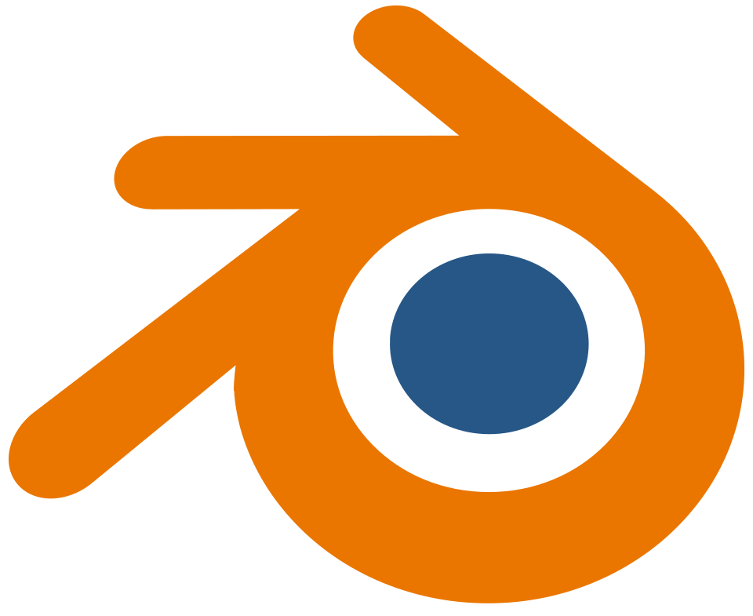
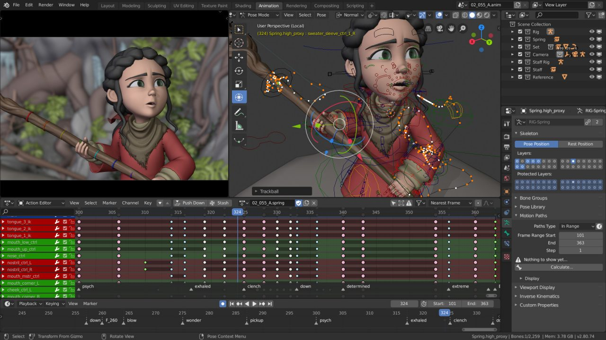

## Blender

### Ohjelma

- **Nimi:** Blender
- **Kuvaus:** 3D-mallinnusohjelmisto, jolla voi mm. luoda 3D-malleja sekä mallien ”rigging/skinning”, animoida (2D/3D, luoda efektejä (Vesi, savu…yms.), renderöidä kuvia/videoita.
- **Toimintaperiaate:** Blenderin voi ladata valmiiksi toimivana ohjelmana. Ohjelmassa luodaan malleja ohjelman näkymässä käyttäen erilaisia työkaluja.
- **Käyttökohteet:** Blenderiä käyttävät mm. 3D-mallintajat, graafikot, pelikehittäjät, animaattorit yms. Käyttökohteita on lukuisia. Blenderiä käyttävät niin harrastelijat kuin isommat (peli)yhtiöt.



### Lisenssi

- **Lisenssi:** GNU General Public Licence V3
  - Sallii vapaan käytön, muokkaamisen ja jakamisen lisenssin ehdoilla
  - Sallii kaupallisen käytön (esim lisätoimintojen myynti)
    
    

### Projektin Aktiivisuus ja Ylläpito

- **Historia:**
  - Alunperin Blender kehitettiin Hollantilaisen animaatiostudion toimesta sisäiseen käyttöön (Ton Roosendaal/NeoGEO), Blenderin kehitys alkoi 1994.
  - Blender 1.0 1995
  - 1998 ”Not a Number (NaN)”, Blenderin jakelu ”Freemium” mallilla, ilmainen ladata, lisäominaisuudet maksullisia.
  - NaN sai kerättyä 5,5milj. rahoituksen, mutta vuonna 2002 NaN lopetti toimintansa huonon taloustilanteen takia. Roosendaal menetti Blenderin oikeudet sijoittajille
  - Roosendaal perusti Blender Foundationin 2002, jonka tavoitteena oli muuttaa Blender avoimenlähdekoodin ohjelmistoksi. Hän onnistui keräämään tarvittavat rahat joukkorahoituksella Blenderin oikeuksien takaisin ostamiseen (110k€)
  - 2002 Blenderistä tuli avoimenlähdekoodin ohjelmisto  GNU lisenssillä

- **Aktiivisuus:** Blenderissä on n. 160000 committia (Github), vuositasolla committeja tulee 10-20k väliltä, +-1000 committia kuukaudessa. Blenderistä on julkaistu useita pääversioita
  - 2.3 series (2003-2005)
  - 2.4 series (2005-2009)
  - 2.5 series (2009-2011)
  - 2.6 series (2011-2013)
  - 2.7 series (2014-2018)
  - 2.8 series (2019-2020)
  - 2.9 series (2020-2021)
  - 3 series (2021-2023)
  - 4 series (2023-2025)
  - 5 series (2025-2027)

- **Ylläpito:** Blenderiä ylläpitää Blender Foundation. Blender Foundation vastaa kehityksen organisoinnista ja ohjaamisesta, kerää rahoitusta ja vastaa suurista versiojulkaisuista.

### Osallistuminen Projektiin

Blender-projektiin voi osallistua esimerkiksi kehittämällä lähdekoodia, dokumentointia, ympäröivää infrastruktuuria ja kielten käännöksiä. Lähdekoodin kehitykseen voi osallistua Gitissä kirjoittamalla issueita bugeista ja lähettämällä pull requesteja.
Kehittäjiä suositellaan ottamaan yhteyttä ensin muihin sen alueen kehittäjiin, jotta työt ei mene hukkaan.

### Tekninen Toteutus

- C++ (79,3%)
- Python (15%, skriptit)
- GLSL (1,9%, varjostimet)
- C (1,7%)
- CMake (projektin rakennus)
- Git (self-hostattu)

### Projekti Käyntiin

- **Asennus ja Käyttöönotto:**

Valmiiksi käännetyt binäärit löytyvät [Blenderin sivuilta](https://www.blender.org/download/).

Ohjeet kääntämistä varten löytyvät myös [Blenderin sivuilta](https://developer.blender.org/docs/handbook/building_blender/).

#### Linux

- Asenna Python, git ja git-lfs

- Lataa lähdekoodit:

```
mkdir ~/blender-git
cd ~/blender-git
git clone https://projects.blender.org/blender/blender.git
```

- Asenna loput riippuvuudet:

```
cd ~/blender-git/blender
./build_files/build_environment/install_linux_packages.py
```

- Päivitä lähdekoodit ja lisäosat:

```
make update
```

- Rakenna Blender:

```
make
```

- Blenderin saa käynnistettyä kansiosta blender-git/build_linux/bin

#### Windows

- Asenna Visual Studio 2022 Community Edition (Desktop Development with C++), Git ja CMake.

- Lataa lähdekoodit:

```
cd C:\blender-git
git clone https://projects.blender.org/blender/blender.git
```

- Päivitä lähdekoodit ja lisäosat:

```
cd C:\blender-git\blender
make update
```

- Rakenna Blender:

```
make
```

- Rakennettu Blender löytyy kansiosta:

`C:\blender-git\build_windows_Full_x64_vc14_Release\bin\Release`
