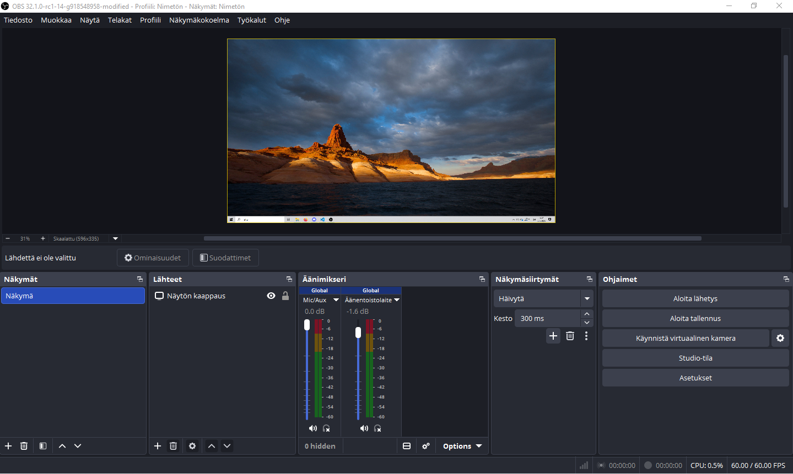
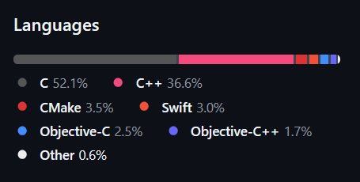

# OBS
OBS on avoimen lähdekoodin ohjelmisto videoiden kuvaamiseen ja lähettämiseen. OBS pystyy kuvaamaan mitä tahansa tietokoneen ruudulta. Videot voidaan tallentaa tietokoneelle käyttäen useita eri formaatteja tai lähettää suoratoistopalveluihin, kuten Twitchiin. OBS sisältää myös virtuaalisen kameran, joka toimii lähettämällä OBS:n kuvaama videokuva muihin sovelluksiin.

## Ohjelmiston käyttö

Näkymä on kokonaisuus, joka pitää sisällään video- ja äänilähteitä. Näkymiä voidaan vaihtaa kuvaamisen / lähettämisen aikana. "Lähteet" osiosta valitaan mitä halutaan kuvata / lähtettää. Lähteenä voi olla esimerkiksi näytön tai tietyn ikkunan sieppaus. Lähteille säädetään omat asetukset, jossa päätetään esimerkiksi otetaanko sieppaukseen mukaan kursori tai lisätään suodattimia, kuten väriavainnus. Lähteitä voidaan pinota päällekkäin, jolloin ylempi lähde peittää alemman. Äänimikserissä voidaan säätää kaikkien äänilähteiden äänenvoimakkuus ja lisätä suodattimia.

"Ohjaimet" osiossa käytetään ohjelmiston päätoimintoja, eli aloitetaan kuvaaminen, lähettäminen tai käynnistetään virtuaalinen kamera.

## Lisenssi
OBS on julkaistu GPL-2.0 lisenssillä. Tämä lisenssi antaa käyttäjille oikeuden tarkastella, muokata ja jakaa lähdekoodia. GPL-2.0 on copyleft lisenssi, jolloin muokatut versiot tulee julkaista samalla lisenssillä. GPL-2.0 lisenssin vastuuvapauden mukaan ohjelmiston kehittäjät eivät ole missään tilanteessa vastuussa mistään vahingoista, joita ohjelmiston käyttämisestä voi aiheutua. Ohjelmisto jaetaan sellaisenaan, ilman mitään takuuta.

## Projektin historia
**Projektin historia**
OBS sai alkusa Lain Baileyn sooloprojektina vuonna 2012, kun hän halusi streamata Starcraftia, mutta silloin ei ollut saatavilla hyviä ilmaisia työkaluja livelähettämiseen. Bailey oli jo perehtynyt näytön kuvaamiseen rakentamalla sovelluksen, joka kuvasi hänen Starcraft karttaansa ja näytti sen suurempana toisella näytöllä. 

Tämän jälkeen hän loi OBS Classicin. OBS oli lyhenne sanalle "observer" ja myöhemmin siitä tehtiin akronyymi sanoille "Open Broadcaster Software". OBS Classic saavutti suuren suosion ja lähti kasvamaan avoimen lähdekoodin projektina useiden osallistujien ansiosta. Vuonna 2013 aloitettiin OBS Studion kehitys, joka oli täysin uudelleenkirjoitettu versio OBS Classicista. OBS Studio on OBS:n nykyinen versio eikä OBS Classicia tueta enää.

**Aktiivisuus**
Obs-studio Github repositoryssä on yhteensä 15 412 committia ja projektiin osallistuneita henkilöitä on 659. Github repo saa noin 10 committia viikottain.

**Ylläpito**
Projektin aloittanut Lain Bailey OBS projektin kokoaikainen pääkehittäjä ja projektin ylläpitäjä.

**Osallistuminen projektiin**
Projektiin voi osallistua avaamalla pull requestin tai issuen Githubissa. Issuet ja pull requestit tulee täyttää mallien mukaan. Kehittäjien kanssa voi keskustella OBS:n Discord palvelimella.

## Tekninen toteutus

OBS:n ydin on libobs kirjasto, joka vastaa video- ja ääniputkesta. Libobsilla on kolme pääsäiettä: obs_graphics_thread, joka vastaa GPU renderöinnistä, video_thread, joka vastaa videon enkoodaamisesta ja ulostulosta ja audio_thread, jota käytetään audion prosessointiin, enkoodaukseen ja ulostuloon.

OBS on erittäin modulaarinen ja lähes kaikki toiminnot muodostuu plugineista, jotka on rakennettu libobsin päälle. Libobs tarjoaa neljä objektia, joille on mahdollista tehdä plugineita: lähteet, ulostulo, enkooderit ja palvelut. 

OBS kirjoitettu C ja C++ ohjelmointikielillä. Käyttöliittymä on toteuttu Qt:lla.

## Kääntäminen lähdekoodista

**Mitä kääntämiseen Windowsilla tarvitaan?**
 - Visual studio 2022
    - Komponentilla: C++ ATL for latest v143 build tools (x86 & x64)
 - Windows 10 SDK (10.0.22621.0 tai uudempi)
 - CMake (3.28 tai uudempi)
 - Git for Windows

**Kääntäminen**

1. Kloonaa repo:
``git clone --recursive https://github.com/obsproject/obs-studio.git ``
>Mikäli käyttämäsi Windows SDK versio on uudempi kuin 10.0.22621.0, päivitä käyttämäsi versio obs-studio kansiossa sijaitsevaan CMakepresets.json tiedostoon.

2. Avaa terminaali ja aja obs-studio kansiossa seuraava komento:
``cmake --preset windows-x64 ``
Tämä valmistelee buildin lataamalla riippuvuudet CMakepresets.json tiedoston mukaan.
&nbsp;
3. Seuraavana aja:
``cmake --build --preset windows-x64``
Tämä aloittaa buildin ja kääntää kaikki projektin osat.
&nbsp;
4. Valmis OBS.exe löytyy hakemistosta:
``\obs-studio\build_x64\rundir\RelWithDebInfo\bin\64bit\obs64.exe``

## Lähteet
1. [OBS Studio dokumentaatio](https://docs.obsproject.com/)
2. [obsproject.com](https://obsproject.com/)
3. [OBS Github repository](https://github.com/obsproject/obs-studio)
4. [Wikipedia](https://en.wikipedia.org/wiki/OBS_Studio)
5. [Lain Baileyn haastattelu](https://gamingcareers.com/podcasts/creating-obs-interview-with-jim/)