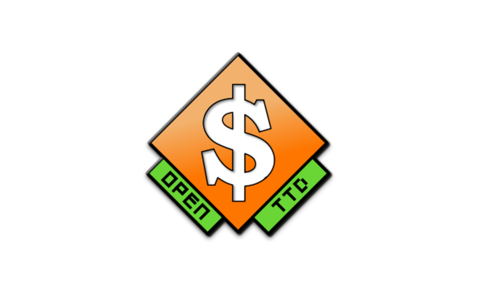
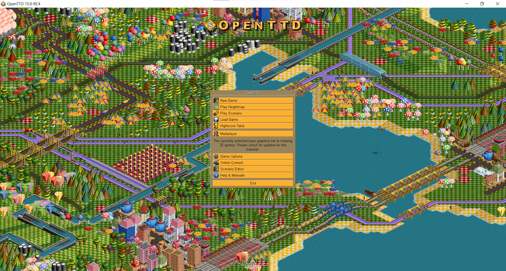
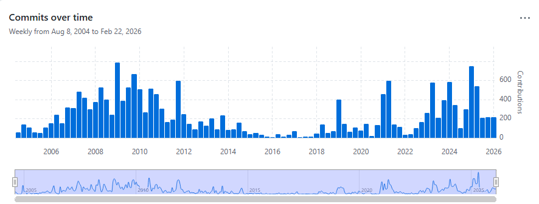

# OpenTTD



OpenTTD on yksi tunnetuimmista ja pitkäikäisimmistä avoimen lähdekooddin peliprojekteista. OpenTTD on moderni simulaatiopeli, joka perustuu klassiseen vuoden 1994 *Transport Tycoon Deluxe* - peliin.

## Ohjelmiston valinta

### Mikä OpenTTD?
**OpenTTD** on simulaatiopeli, jossa toimit kuljetusyrityksen johtajana. Pelin pääasiallinen tarkoitus on rakentaa ja hallinnoida kattavaa kuljetusverkostoa ja varmistaa, että matkustajat ja rahti liikkuvat tehokkaasti paikasta toiseen. 

### Miten ohjelmisto toimii?
Peli toimii **[ruutupohjaisessa ympäristössä](https://en.wikipedia.org/wiki/Isometric_video_game)**, jossa pelaaja:
- Rakentaa infrastruktuuria (kuten rautateitä, asemia ja teitä).
- Ostaa ja aikatauluttaa kulkuneuvoja.
- Kilpailee pelin omaa tekoälyä tai muita pelaajia vastaan markkinaosuuksista.

### Missä tilanteissa käytetään?
OpenTTD toimii ensisijaisesti **viihdekäytössä**, mutta se on peli, joten sitä voi hyödyntää myös:
- Oppimisympäristönä logistiikan, resurssienhallinnan ja infrastruktuurin suunnittelun perusteisiin.
- Yhteisöllisyyden ja verkostoitumisen apuvälineenä

---


## Lisenssi: **[GNU General Public License](https://github.com/OpenTTD/OpenTTD?tab=License-1-ov-file#readme)**
OpenTTD on julkaistu GPL-lisenssillä, joka perustuu ajatukseen ohjelmiston neljästä perusvapaudesta, jotka ovat **Vapaus käyttää, tutkia, jakaa ja muokata ohjelmistoa**

### Ehdot
GPL-lisenssin ehdot suojaavat käyttäjän oikeuksia ja varmistavat projektin jatkuvuuden:
- **Lähdekoodin avoimuus** 
    - Jos jakaa ohjelmistoa eteenpäin, on annettava pääsy lähdekooddiin kokonaisuudessaan.
- **Copyleft-periaate**
    - GPL lisenssin tärkein ehto: jos tekee muutoksia koodiin ja julkaisee ne, myös näiden muutosten on oltava GPL-lisenssin alaisia. Tämä ehto estää koodin tietynlaisen omimisen suljetuksi ohjelmistoksi.
- **Muutosten dokumentointi**
    - Jos muokkaa tiedostoja, on niihin lisättävä maninta tehdyistä muutoksista ja päivämäärästä.
- **Alkuperäisten tekijöiden kunnioittaminen**
    - Kaikki alkuperäiset tekijänoikeusilmoitukset ja lisenssitekstit on säilytettävä koodissa.

### Rajoitukset
GPL-lisenssin rajoitukset on suunniteltu estämään ohjelmiston muuttaminen suljetuksi:
- **Ei suljettua kaupallistamista**
    - Ohjelmiston koodia ei saa ottaa niin, että siihen lisätään omia ominaisuuksia ja myydään eteenpäin suljettuna tuotteena, jonka lähdekoodi on piilossa.
- **Vastuuvapaus**
    - Ohjelmisto tarjotaan sellaisena kuin se on eivätkä tekijät ole vastuussa mahdollisista vahingoista tai virheistä, joita ohjelmiston käyttö saattaa aiheuttaa.
- **Lisenssin muuttaminen**
    - Ohjelmiston lisenssiä ei voi muuttaa kaupalliseksi tai sellaiseksi, joka rajoittaa muiden oikeuksia käyttää koodia.
- **Yhteensopivuus muiden lisenssien kanssa**
    - GPL-koodia ei voida yhdistää sellaiseen koodiin, jonka lisenssi kieltää lähdekoodin jakamisen.

## Projektin historia
- OpenTTD julkaistiin vuonna 2004 Ludvig Strigeuksen toimesta. 
- Alunperin kirjoitettu C-kielellä ja vuodesta 2007 lähtien uudelleenkirjoitettu C++ -kielelle. 
- 2021 lähtien pelin on ollut mahdollista ladata Steamin kautta ilmaiseksi. 
- Viimeisin suuri päivitys on tältä vuodelta joka lisäsi OpenTTD:ään mm. uudistetun päävalikon.


## Projektin aktiivisuus

- Peliä on kehitetty aktiivisesti yli 20 vuotta vaikkakin 2010-luvulla oli vähän hiljaisempaa. 
- Aktiivisin kehittäjä on rubidium42 niminen github käyttäjä yli 6500 commitillaan.
- Muita aktiivisia kehittäjiä ovat PeterN, frosch123 ja TrueBrain joilla jokaisella on yli 1500 committia.

## Osallistuminen projektiin
- Projektiin osallistuminen on kaikille avointa. Bugeja voi raportoida Github sivuillaan ja samoin myös tehdä pull requesteja. Pull requsteille on kuitenkin tarkat ohjeet, joissa suositellaan kysymään asiasta ensin heidän Discord palvelimellaan.

- Viralliset ja tarkemmat ohjeet voi lukea täältä: **[ohjeet](https://github.com/OpenTTD/OpenTTD/blob/master/CONTRIBUTING.md)**

---

## Tekninen Toteutus

### Kielet
Pelin moottori ja pelilogiikka on kirjoitettu C++-kielellä. 
Ohjelma käyttää myös Squirrel-kieltä, jota käytetään scriptaukseen sekä AI:n luomiseksi peliin. 
### Protokollat 
Ohjelma käyttää TCP/IP-protokollaa verkko-yhteyden luomiseen moninpelin toteutukseen sekä HTTP-protokollaa erillaisen sisällön, kuten grafiikan- ja ääniresurssien lataamiseen. 
### Työkalut 
Ohjelma voidaan rakentaa ja konfiguroida käyttämällä CMake-työkalua.  
Github version hallintana.
Kehitysympäristönä käytetään Visual Studio 2022 tai uudempaa versiota.
Windows-liitymä tarvitsee vcpkg-tiedostoja, joiden avulla erilaisien pakettejen hallinta tapahtuu. 

---

## Ohjelmiston Käyttöönotto:
OpenTTD on ilmaiseksi ladattavissa Steam-verkkokaupasta **[steam](https://store.steampowered.com/app/1536610/OpenTTD/)**, 
Microsoft-kaupasta **[mikrosoft](https://apps.microsoft.com/detail/9ncjg5rvrr1c?hl=en-US&gl=FI)** ja 
Gog pelikaupasta **[gog](https://www.gog.com/en/game/openttd)**.

OpenTDD voidaan myös ottaa käyttöön lataamalla tiedostot githubista ja rakentamalla ohjelman itse. 

OpenTTD-käyttöä varten tulee ladata Visual Studio 2022 tai uudempi versio. 
Visual Studio sinun tulee hakea paketti **Desktop development with C++**.
Tämän lisäksi sinun tulee hakea yksittäisiä komponentteja, joita ovat. 
* MSVC v143 - VS 2022 C++ x64/x86 build tools
* Windows 10 SDK **tai** Windows 11 SDK
* C++ CMake tools for Windows


Tämän lisäksi tulee ladata Cmake, joka on oltava versioltaan vähintään 3.16.

OpenTTD voidaan clonata [OpenTTD](https://github.com/OpenTTD/) -sivulta. 

Tämän lisäksi OpenTTD tarvitsee grafiikat, musiikit ja äänet, jotka tulee ladata erikseen ja asettaa OpenTTD:n **baseset/**-kansioon. 

---
#### Windows
OpenTTD tarvitsee vcpkg-tiedostot, joiden avulla erillaisien vaatimuksien käsittely tapahtuu. Vcpkg voidaan ladata osoitteesta [vcpkg](https://github.com/microsoft/vcpkg/tree/master), ja tarkemmat ohjeet sen asennuksen löytyvät [vcpkg-ohjeet](https://github.com/Microsoft/vcpkg/blob/master/README.md). 
Ensiksi tulee ajaa vcpkg asennus ja sen intergraatio
```ruby
bootstrap-vcpkg.bat  
.\vcpkg integrate install
```
Tiedostoon jonne asensit vcpkg:n sinun tulee asentaa riipuvuudet ajamalla seuraavat komennot:
```ruby
.\vcpkg  install  breakpad:x64-windows-static  
.\vcpkg  install  liblzma:x64-windows-static  
.\vcpkg  install  libpng:x64-windows-static  
.\vcpkg  install  lzo:x64-windows-static  
.\vcpkg  install  zlib:x64-windows-static
```
OpenTTD-tiedostossa sinun tulee luoda build-kansion, jonne sitten luodaan CMakeillä build-kansiot seuraavilla komennoilla. (Aseta kohtaan **<location of vcpkg>**, minne vcpkg on ladattu.)
```
mkdir build
cd build
cmake.exe .. -G"Visual Studio 17 2022" -DCMAKE_TOOLCHAIN_FILE="<location of vcpkg>\vcpkg\scripts\buildsystems\vcpkg.cmake" -DVCPKG_TARGET_TRIPLET="x64-
windows-static"
cmake --build . --config Release
```
---
#### Linux 

Linuksilla voidaan asentaa vaatimukset seuraavalla komennolla. 
```
sudo apt install cmake g++ libsdl2-dev zlib1g-dev libpng-dev \  
liblzma-dev liblzo2-dev libcurl4-openssl-dev \  
libfreetype6-dev libfontconfig1-dev libharfbuzz-dev libicu-dev
```
Jotta prokekti voidaan rakentaa, tulee ajaa seuraavat komennot OpenTTD-kansiossa. 
```
mkdir build
cd build
cmake ..
make
```

Tarkemmat ohjeet projektista löytyvät githubista: [OpenTTD](https://github.com/OpenTTD/OpenTTD)
Tarkemmat ohjelman käännösohjeet löytyvät: [OpenTTD-Combiling](https://github.com/OpenTTD/OpenTTD/blob/master/COMPILING.md)

