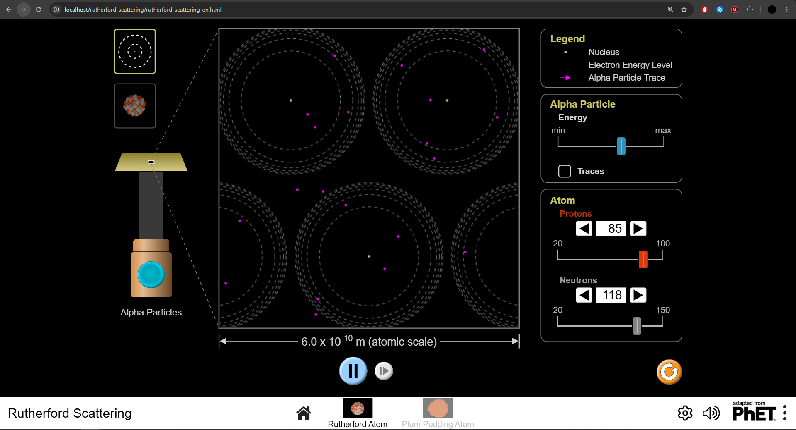

# PhET simulaatiot

## Ohjelmiston Valinta:  

### Phet Interactive Simulations

PhET luo ilmaisia interaktiviisia avoimen lähdekoodin opetussimulaatioita, jotka perustuvat luonnontieteisiin ja matematiikkaan.

PhET- simulaatiot toimivat selaimessa tai paikallisesti. Simulaatiot toimivat pääasiallisesti Java- ja TypeScriptillä sekä HTML5:llä. PhET- simulaatiot käyttävät SceneryStack- verkkokehityskirjastoja. Simulaatiot kuuluvat omiin Git- repoihinsa, jonka lisäksi ne käyttävät muita yhteisiä Git- repoja jotka sisältävät eri työkaluja ja kirjastoja.

PhET- simulaatioita käytetään pääasiassa opetuksen yhteydessä eri fysiikan teorioiden ja simulaatioiden opetukseksessa. Esimerkiksi UEF:n fysiikan kursseilla PhET- simulaatioita on käytetty esim. Rutherford- Scatteringing kuvaamiseen.



## Lisenssi:

Simulaatiot ovat GPLv3- lisensseillä ja muut uudelleenkäytettävät kirjastot MIT- lisensseillä.

### GPLv3
Copyleft lisenssi. Saa käyttää vapaasti kaikkiin tarkoituksiin, mutta täytyy julkaista samalla lisenssillä.

### MIT
Saa käyttää vapaasti paitsi alkuperäinen tekijänoikeusilmoitus ja lisenssiteksti on sisällytettävä kaikkiin kopioihin.

## Projektin historia ja aktiivisuus: 

PhET- projekti käynnistettiin vuonna 2002 ja kehitys jatkuu edelleen. PhET tuli GitHubiin vuonna 2012. Aktiivisimmat kehityksen vuodet ovat olleet 2013 ja 2015. Projektia ylläpitää CU Boulderin (University of Colorado Boulder) PhET- tiimi.

## Osallistuminen projektiin:  

Projektiin voi osallistua myös PhETin ulkopuoliset kehittäjät ja osallistuminen tapahtuu GitHubin kautta.  
Projektin kehittäjille ei ole tiettyjä rooleja (muuta kuin itse PhET- tiimi ja ulkopuoliset). PhET tiimi on vastuussa pull requestien hyväksymisestä.  
Muutosten teko vaatii yleisiä työkaluja, kuten gitin ja IDE:n. Koodi on pääasiallisesti JavaScriptiä ja tarvitaan myös Node.js, npm ja Grunt ohjelman asentamiseen ja ajamiseen.

## Tekninen toteutus:  

### Kielet
- TypeScript
- JavaScript
- HTML
- Swift
- Fluent

### Protokollat
Rakennettu oma SceneryStack kirjasto, jota käytetään grafiikan piirtämiseen, käyttäen Canvas API ja WebGL.

Matematiikka ja geometrialle on rakennettu Dot- ja Kite-kirjastot. 

## Ohjelmiston Käyttöönotto:
Esimerkki kuinka saada toimimaan Rutherford- scattering- simulaatio 
### Phet Simulation Rutherford- Scattering

[Phetsims GitHub](https://github.com/phetsims/rutherford-scattering?tab=readme-ov-file#rutherford-scattering)  

1. Tee Git- kansio
2. Kloonaa seuraavat repositoryt kansioon

    ```
    git clone https://github.com/phetsims/assert.git
    git clone https://github.com/phetsims/axon.git
    git clone https://github.com/phetsims/babel.git
    git clone https://github.com/phetsims/brand.git
    git clone https://github.com/phetsims/chipper.git
    git clone https://github.com/phetsims/dot.git
    git clone https://github.com/phetsims/joist.git
    git clone https://github.com/phetsims/kite.git
    git clone https://github.com/phetsims/perennial.git perennial-alias
    git clone https://github.com/phetsims/phet-core.git
    git clone https://github.com/phetsims/phetcommon.git
    git clone https://github.com/phetsims/phetmarks.git
    git clone https://github.com/phetsims/query-string-machine.git
    git clone https://github.com/phetsims/rutherford-scattering.git
    git clone https://github.com/phetsims/scenery.git
    git clone https://github.com/phetsims/scenery-phet.git
    git clone https://github.com/phetsims/sherpa.git
    git clone https://github.com/phetsims/shred.git
    git clone https://github.com/phetsims/sun.git
    git clone https://github.com/phetsims/tambo.git
    git clone https://github.com/phetsims/tandem.git
    git clone https://github.com/phetsims/twixt.git
    git clone https://github.com/phetsims/utterance-queue.git
    ```

3. Asenna node- riippuvuudet seuraaviin sijainteihin

    ```
    cd chipper
    npm install
    cd ../perennial-alias
    npm install
    cd ../rutherford-scattering
    npm install
    ```

4. Aja Grunt- kehityspalvelin chipper- kansiossa
   
    ```
    grunt dev-server
    ```
    Jos sinulla ei ole Grunttia, asenna se:
    ```
    npm install -g grunt-cli
    ```

5. Avaa kehityspalvelin. Simulaatio löytyy sijainnissa 
   
   ```http://localhost/rutherford-scattering/rutherford-scattering_en.html```

---

*Huom : Varmista, että sinulla on seuraavat asennettuna:*
- Node.js (`node-v`) , (`npm -v`)
- git (`git -v`)
- grunt (`grunt -v`)
