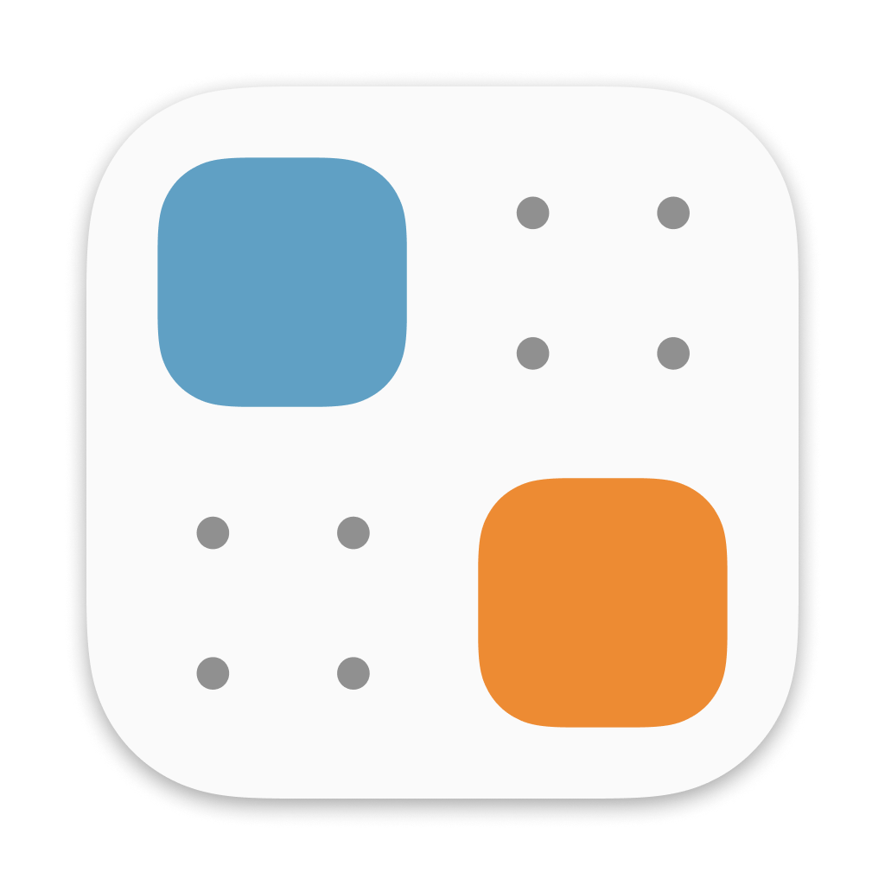

# Mikä on Plugdata? (https://github.com/plugdata-team/plugdata)

Plugin wrapper Pure Data:lle (PD), jonka avulla PD:tä voi käyttää hyödyksi melkein kaikissa DAW:ssa

Pääkehittäjänä Timothy Schoen

# Mikä  sitten on Pure Data? (https://puredata.info/)

Pure Data on visuaalinen ohjelmointi kieli, jolla voi luoda graafisia ohjelmia, ilman "normaalia" koodaamista. Sillä voi:

1. Prosessoida ja luoda audiota
2. Luoda ja muokata videota (esimerkiksi audion perusteella) 
3. Luoda graafisia objecteja, jotka toimivat.
4. Ottaa vastaan erilaisia input tietoja kuten MIDI:ä ja sensoreita.

# Tekniset tiedot 
### Koodikielet 
1. C (53.9%) 
2. C++ (17,4%)
3. Makefile (9.5%)
4. Shell (7.5%)
5. HTML (6.9%)
6. TeX (1.9%)
7. Muut (2.9%)

### 

### Kontribuuttorit
**20**

Mutta Projektiin on sisäänrakenettu 9 muuta avoimen koodin ohjelmistoa. Näissä ohjelmistoissa on nopeasti laskettuna +150 kontribuuttoria (Varmasti tietty paljon samoja)

### Lisenssi

Projetki sisältää JUCE nimisen frameworkin (https://github.com/juce-framework/JUCE), eli itse koko ohjelma on eri lisensillä.

GNU Affero General Public License (https://www.gnu.org/licenses/agpl-3.0.en.html)

Mutta itse plugdata koodi on gpl 3.0 lisenssillä.

(https://www.gnu.org/licenses/gpl-3.0.en.html)

Kaikilla ulkopuolisilla komponenteilla on myös omat lisenssinsä. 

# Historia

### Ensimmäinen versio julkaistu Githubiin tammikuussa 2022
### Uusin versio on v0.9.3-2, eli jatkuvasti kehitetään ja ei ole NS: valmis

### Itse PD jonka päälle Plugdata suuresti perustuu on ollut kehitteillä vuodesta 1996

# Projekti käyntiin

### Windows
Installer löytyy nettisivulta ja toimii hetin sen jälkeen ohjelmana sekä DAW vst:nä.

### MacOS
Installer

### Linux

1. OBS repo https://software.opensuse.org//download.html?project=home%3Aplugdata&package=plugdata
2. ARCH löytyy AUR:ista
3. Binäärit

# Muuta

### Plugdata on kaksi yritystä sponsoroimassa. GIG Performer ja JetBrains
### Niinkun aiemmin mainittu projektissa on sisällä monia muita projekteja komponenteina tai hyödynnyskäytössä. Plugdata voisi pitää vähän niinkuin modernina käyttöympäristönä monille muillekkin teknologoille. Se yhdistää siis todella monia avoimenlähdekoodin ohjelmistoja "uuden katon" alle.

### DEMO näytin sen tallennuksessa.
